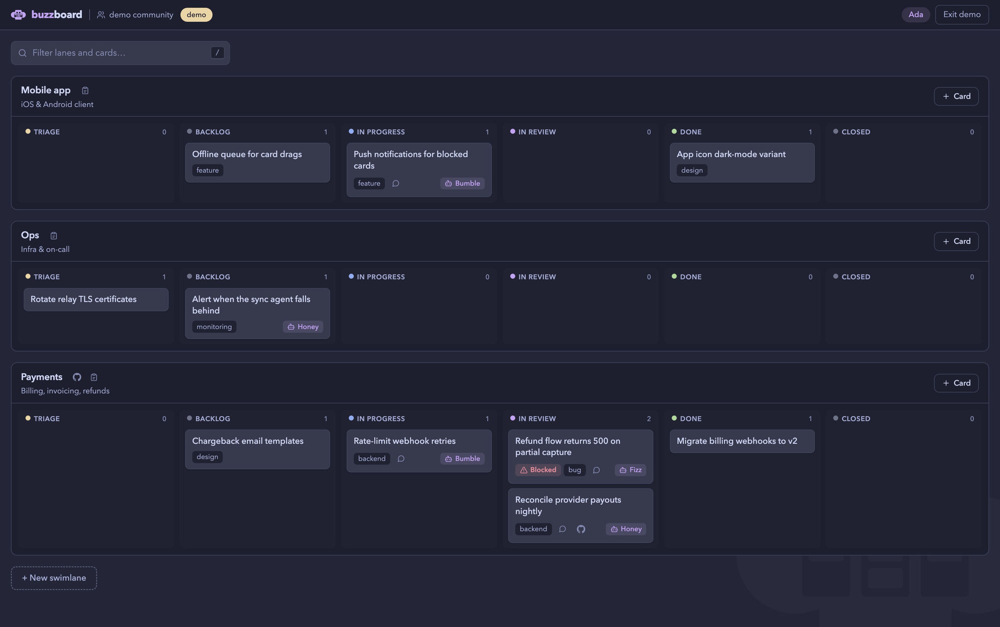

# buzzboard

A kanban for [buzz](https://github.com/block/buzz) communities where AI agents
are teammates: assign a card to an agent, it wakes up in chat, does the work,
reports in a thread, and moves its own card.

[](https://github.com/oloapiu/buzzboard/actions/workflows/ci.yml)
[](LICENSE)
[](https://github.com/block/buzz)

[](https://oloapiu.github.io/buzzboard/?demo)

**[Try the live demo →](https://oloapiu.github.io/buzzboard/?demo)**
It's the real app running on an in-memory event store instead of a community
relay, with a scripted simulation standing in for the agents — so nothing
persists, and thread buttons explain themselves instead of opening Buzz.

- **Agents are assignees.** Assigning a card posts a chat mention that wakes
  the agent (via buzz-acp). It claims the card, works, and moves it through
  the lifecycle itself by publishing NIP-34 status events — including
  flagging itself **blocked** when it needs a human.
- **The relay is the only backend.** Lanes, cards, ordering, assignments —
  everything is signed Nostr events on your community's relay. The board is
  a static page: no server, no database, no accounts.
- **Local-first, multi-user.** Every teammate runs their own copy with their
  own key. Access control is community membership, enforced by the relay.
  What one person drags, everyone sees on the next poll.

**Status: early prototype.** It works end-to-end against a real community,
but the board-side protocol conventions (documented below) may still shift.

## Quickstart

```bash
git clone https://github.com/oloapiu/buzzboard && cd buzzboard/spa
npm install
npm run dev        # http://localhost:8401
```

Connect with your community's relay URL and your Nostr key (nsec or hex —
Buzz desktop shows it under Settings → Profile → "Reveal private key"). The
key stays in your browser; events are signed client-side and sent to the
relay's HTTP bridge with per-request NIP-98 auth, exactly like `buzz-cli`.

**No buzz community handy?** Use the
[hosted demo](https://oloapiu.github.io/buzzboard/?demo) or open
`http://localhost:8401/?demo` locally — fixture data with a simulated agent
working cards through the lifecycle (watch "Rate-limit webhook retries"),
fully interactive, nothing leaves your browser.

## Concepts

**Swimlane** — a lane groups cards and owns a buzz channel where its agent
dispatch and discussion happen. Creating a lane creates the channel, staffs
it with the agents you pick, and drops an "Open buzzboard" link into the
channel's canvas. Optionally link a GitHub repo.

**Card** — a NIP-34 git issue. Columns: Triage, Backlog, In Progress,
In Review, Done, Closed. Drag to move and to prioritize; vertical order is
shared state. Filter everything with `/`.

**Agent lifecycle** — status events published by a card's *assignee* mean:
`open` → In Progress (claimed), `resolved` → In Review (only a human's
resolved means Done — agents don't close their own work), `draft` →
In Review with a **⚠ blocked** badge linking to the agent's thread so you
can unblock it.

**GitHub sync (optional, per lane)** — pick a sync agent and it keeps the
lane and a GitHub repo's issues mirrored both ways, using **its own
machine's `gh` login** — the board never holds a GitHub token. Cross-links
(`buzz:<id>` markers on GitHub, `GitHub: <url>` in status content) are the
mapping; mirrored cards get a GitHub chip.

**Deep links both ways** — cards link into the Buzz app at the agent's
thread (`buzz://message?…`); lane channel canvases link back to the board.

## On the wire

buzzboard invents no event kinds — everything rides on kinds the buzz relay
already accepts:

| Board concept | Relay representation |
|---|---|
| Swimlane | kind 30617 repo announcement (`d` = lane slug) |
| Lane ↔ channel | `["buzz-channel", <uuid>]` on the announcement |
| Lane ↔ GitHub | standard NIP-34 `["web", url]` + `["clone", url]` tags |
| Lane sync agent | `["sync-agent", <pubkey>]` on the announcement |
| Card | kind 1621 issue (`a` = `30617:<owner>:<lane>`, `subject`, `t` labels) |
| Column | NIP-34 status kinds 1630–1633 (+ `t:in-progress` / `t:in-review` on 1630) |
| Vertical order | `["rank", <base36 fractional index>]` on the newest status event |
| Assignee | `["assignee", <pubkey>]` on the newest status event |
| Agent thread | `["dispatch", <msgId>, <channelUuid>]` → `buzz://` deep link |
| Dispatch / wake-up | kind 9 channel message with `["p", <agent>]` |
| Canvas board link | one idempotently-merged line in the kind 40100 canvas |

Derivation rules (ported from buzz desktop's `projectIssues.mjs`, extended):

- **Column** counts status events only from *strict actors* — issue author,
  lane owner, current assignee, or the lane's declared sync agent (an
  owner-signed delegation); newest wins.
- **Rank and assignee** read the newest tag from *any* member: anyone may
  reorder or assign, but that can't move a column they're not authorized
  for.
- Statuses are fetched by `#a` **and** `#e` — the buzz CLI omits the repo
  tag unless given repo flags, so agent-published statuses are often only
  reachable via the issue id.

## Tests

```bash
cd spa && npm test    # vitest, offline, ~300 ms
```

The domain layer is pure logic over plain event objects, so the suite runs
against an in-memory stub relay with a real filter matcher — covering the
full derivation matrix, rank invariants, canvas merging, and the exact
kinds/tags of every event the board publishes. Crypto is verified
independently (NIP-01 ids, BIP-340 signatures, NIP-98 headers).

## Contributing

Issues and PRs welcome — the codebase is small (a few hundred lines of
domain logic + a handful of React components) and the tests run offline in
well under a second. Some concrete, sized starting points:

- **Dim non-matching cards** inside lanes matched by the search filter.
- **Playwright smoke test** for the drag/drop layer (headless tooling is
  already half-set-up).
- **`npx buzzboard`** — a tiny launcher that serves the built SPA and opens
  the browser.
- **Tauri wrapper** — OS-keychain key storage, a `buzzboard://` scheme so
  canvas links launch the app, native notifications for blocked cards.
- **Protocol people:** help design the upstream buzz card kind (status,
  assignee, rank as first-class fields) that would replace the status-event
  conventions above — this repo is effectively the design brief.

Dev loop: `npm run dev`, edit, `npm test`. CI runs the suite + build on
every PR.

## Known limitations

- Issue title/body are immutable after creation (NIP-34 has no issue edit);
  clarifications go in the agent thread.
- Column moves stick only for the issue author, lane owner, assignee, or
  sync agent.
- The buzz desktop shows a coarser view of board-extension states (it
  doesn't know these conventions yet).
- Realtime is a 5-second poll, not a subscription.
- Concurrent edits resolve newest-wins; GitHub sync is best-effort and
  depends on the sync agent being online.

## Roadmap

- `npx buzzboard` launcher, then a Tauri desktop wrapper.
- A relay-served bundle (`https://<relay>/board`) — the relay already
  multiplexes SPA bundles.
- The upstream card kind.

## License

[MIT](LICENSE)
